# July 13th: Research

Started research on the initial idea. Refined the idea. The original idea was just a spotify song player but now I'll be using a raspberry pi so it can do a lot more stuff aswell. it'll tell environemental information like humidity, air quality, temperature by using sensors. and it can also act like a digital frame aswell.

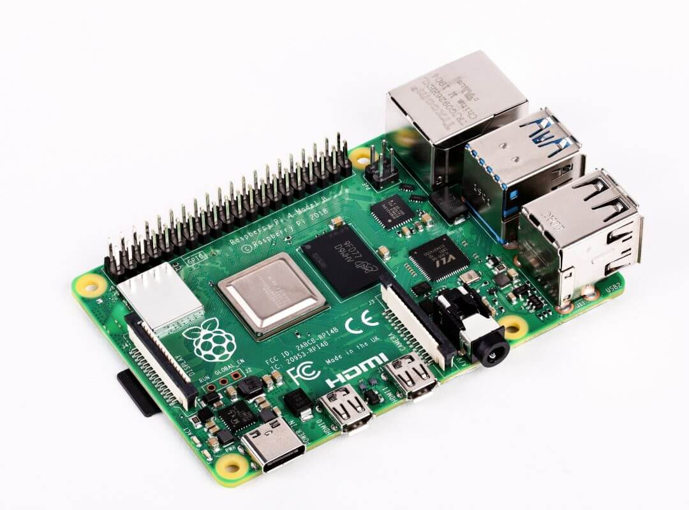

**Total time spent: 3.5h**

# July 14th: More Research

Did some more research ont he parts i'll need. I'll need a BME688 Sensor for temperature, humidity, and air quality. a BH1750 sensor for light so it can adjust brightness automatically. a touchscreen, and maybe a cooling fan for the raspberry pi. and speakers aswell. also thinking of adding rgb light strips for ambient lighting.

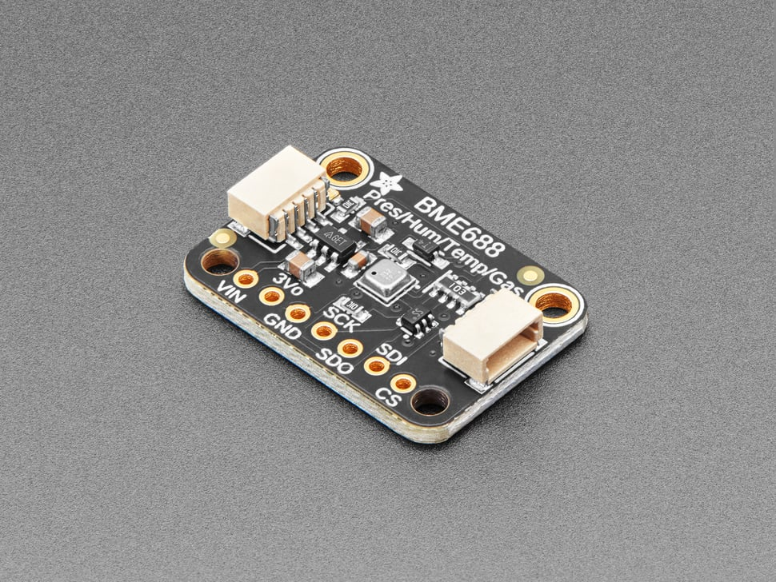
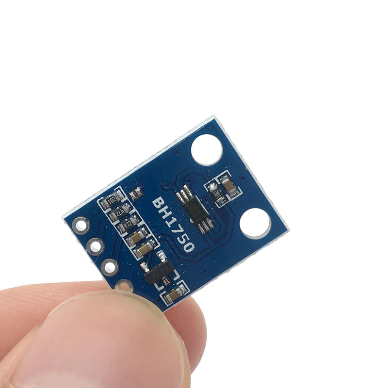

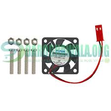
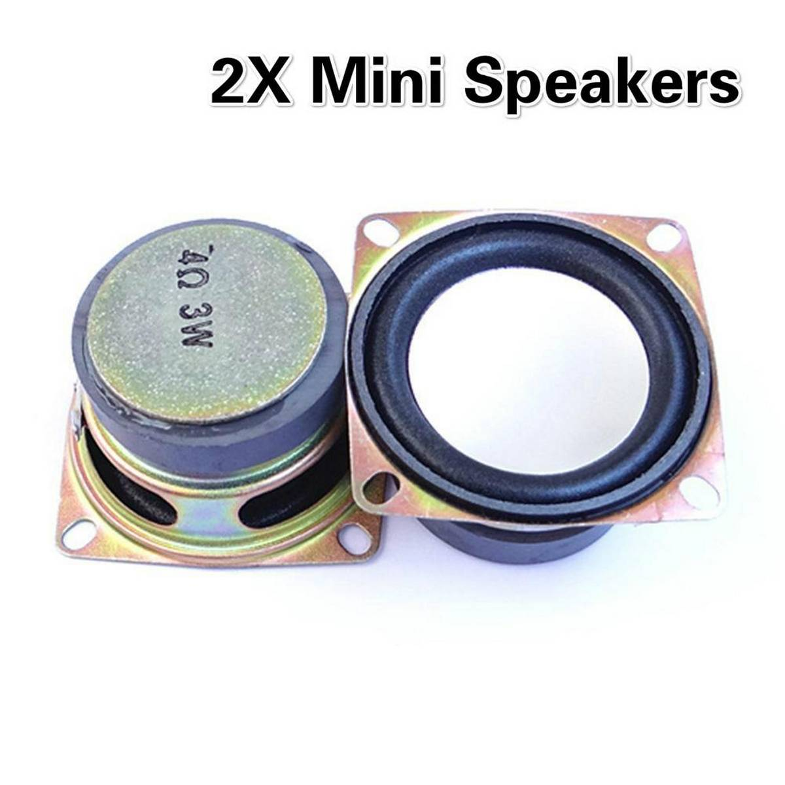

**Total time spent: 4.5h**

# July 15th: Started 3d design of the case

Started the design of the case. going with a triangular design for now. where the touchscreen is on the sloped part. took me WAY longer than it shouldve because its my first time doing anything cad related. Using tinkercad because its easier to understand. I've made like 4 drafts of the main design and i'll choose one of these now and refine it further.

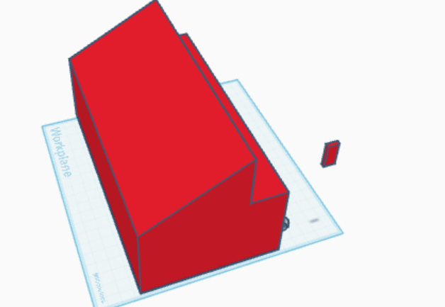
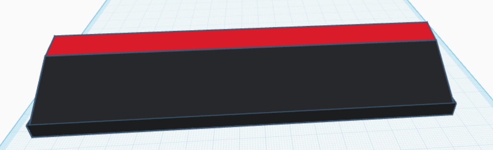
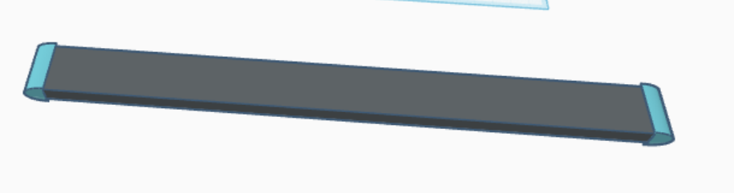
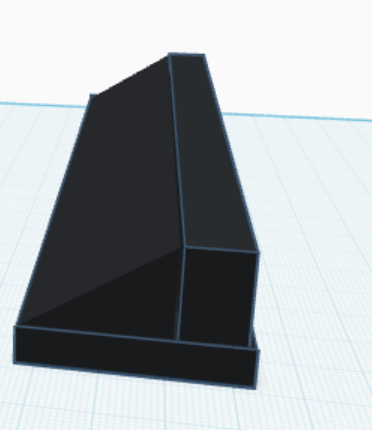

**Total time spent: 7h**

# July 16th: Refined 3d Design

Going with the 4th design. The whole slope part can be the touchscreen. Refined it further. Made it hollow from the inside, which also took me way more time than it should've. I'm still not sure about the dimensions. they're 200x150x90 mm for now. the components i want will fit in this tho. Still have to decide the design of the buttons and probably a mesh at the back to allow airflow aswell, and for the speakers too.

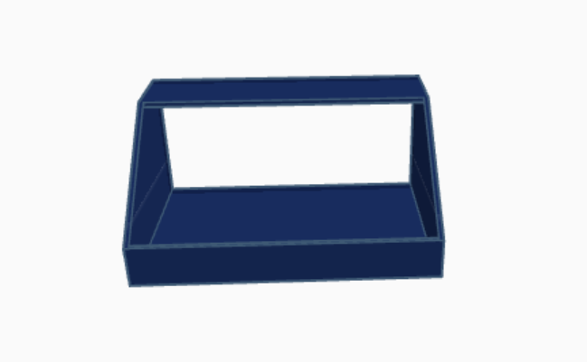
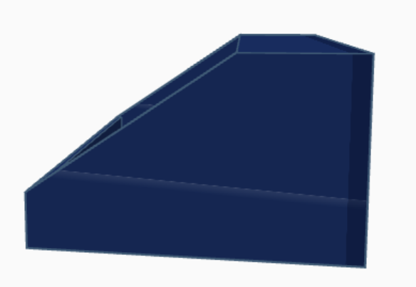
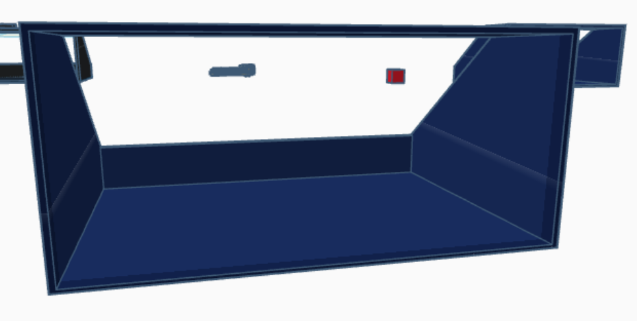

**Total time spent: 4h**

# July 17th: Found parts

Made a list of all the parts I needed and checked prices on multiple websites. Found them all on aliexpress and completed my cart. It has all the parts I need other than the case and some small things like a couple resistors because aliexpress only has packs of 20 or 50 on there and I only need a couple so I think I'll buy this stuff from local shops when everything else arrives. Made a BOM with everything. Prices in pkr and usd both. Also included the description of every part to explain why it's needed. Added aliexpress links to everything aswell. (i used the pkr-usd conversion rate on google). Will finalize the 3d design and then start working on the os after this.

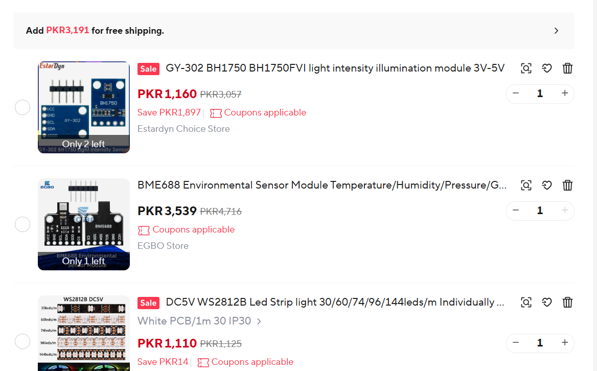
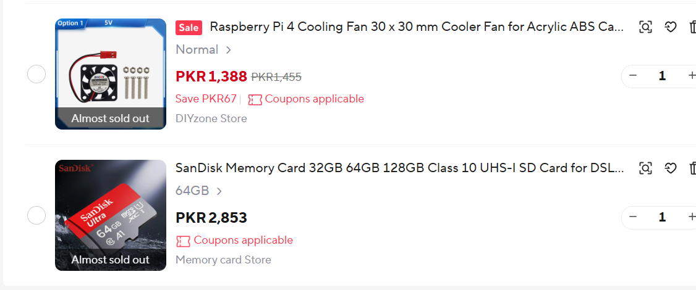

**Total time spent: 2.5h**